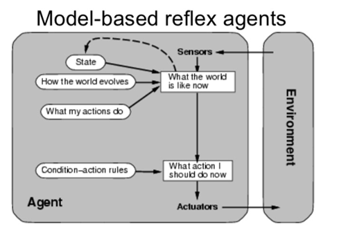

# Homework 1 - Reflex Vacuum Agent With State

Extend the REFLEX-AGENT-WITH-STATE program to
have 4 locations (4 squares): 

- The agent should only sense and act on the square where it is
located. 

- Allow any starting square

- Use run (20) to test and display results. 

Answer:
    
        Current                        New
    location    status  action  location    status
    A           Dirty   Suck    A           Clean   
    A           Clean   Right   B           Dirty   
    B           Dirty   Suck    B           Clean   
    B           Clean   Down    D           Dirty   
    D           Dirty   Suck    D           Clean   
    D           Clean   Left    C           Dirty   
    C           Dirty   Suck    C           Clean   
    C           Clean   Up      A           Clean   
    A           Clean   Everything is clean!
    
    
    I just copy/pasted the result from the code. 
    The code was copied from the assignment we had to assign last year (2018).