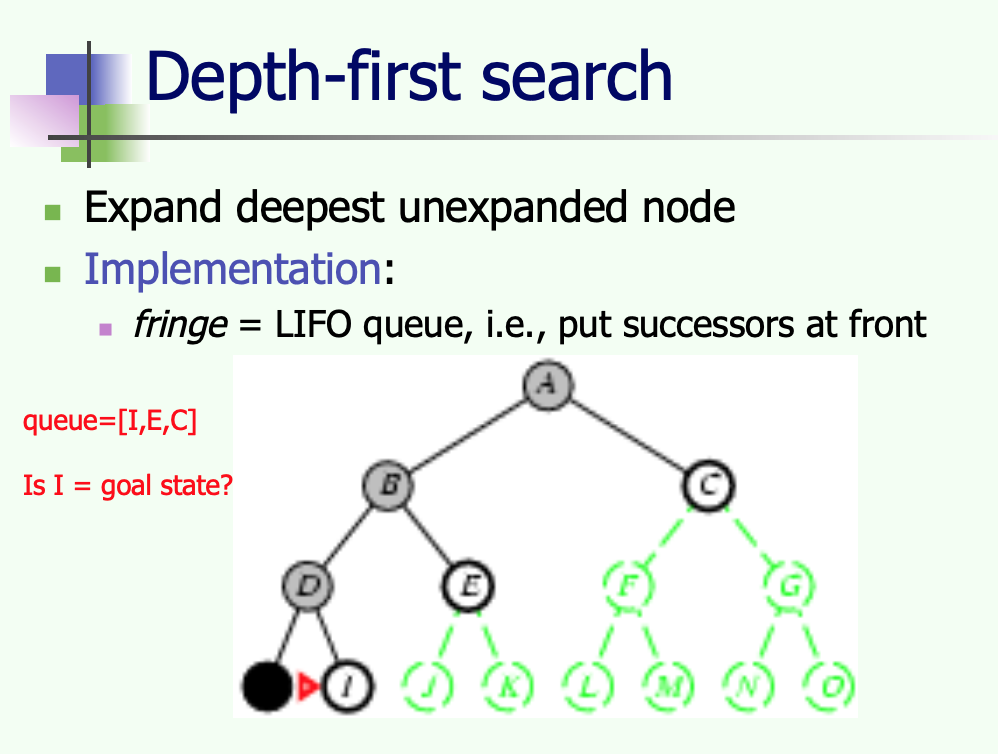
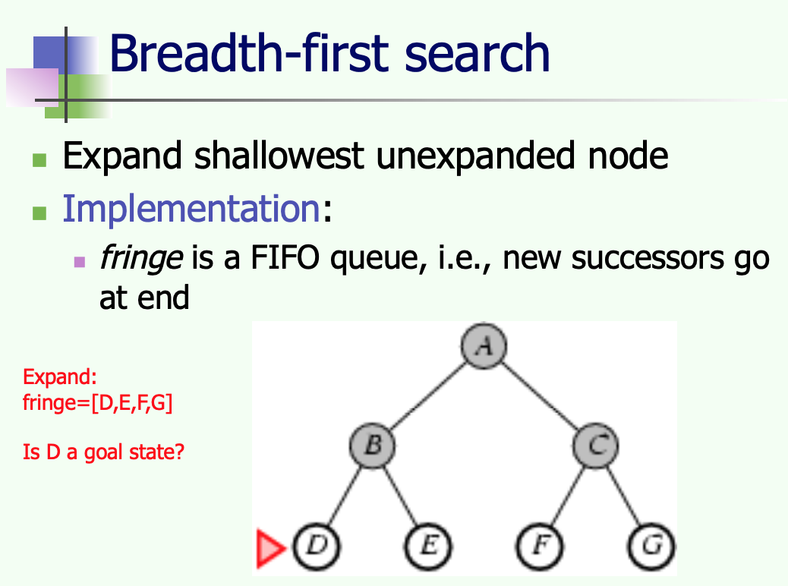
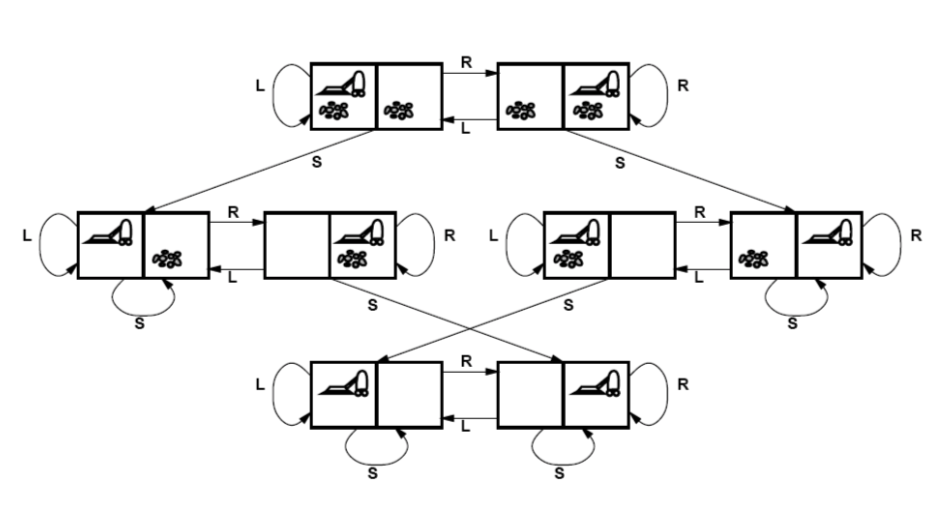

# Uninformed Search - Exercise 1

##### DFS (Depth-first search)

##### BFS (Breadth-first search)

1. Successor nodes are inserted at front of the fringe (successor list) as a node is expanded. Is this a breadth (LIFO) or depth-first search (FIFO)?

Answer:
    
    It is according to the picture, 
    Depth-first search that inserts successor nodes at front of 
    the fringe as node is expanded. 

2. For goal J, give the fringe (successor list) after expanding each node.

Answer:
    
    ??
    
3. What is the effect of inserting successor nodes at the end of the fringe as node is expanded? 
A depth or breadth-first search?

Answer:

    The effect is that it uses the breadth-first search, which expands all the nodes up in front, 
    and then expands all the next nodes in the next row of nodes. This gives an overview of all the possible successor nodes.

4. For goal J, give the fringe (successor list) after expanding each node.

Answer:

    ??
    
#Vacuum world state space graph
    

As you can see, the Vacuum exercise/example looks like this, when it is drawn. 
This is basically how the search tree for the vacuum (A and B) works.

#FIFO vs LIFO
It could be worth knowing about LIFO and FIFO Data structures before diving into these algorithms.

###- LIFO
A LIFO is basically when the stack is adding and removing an element on top of the stack. 
All these simply happen on TOP of the stack.

**EXAMPLE:** The Depth-first search ***(DFS)*** algorithm is using LIFO, 
where its successor nodes is put in the front (top) of the stack.

s
###- FIFO
A FIFO is when an element is added top the top and removed from the bottom of the stack.

**EXAMPLE:** The Breadth-first search ***(BFS)*** algorithm is using FIFO, 
where the new successor nodes goes to the end (bottom) of the stack.

